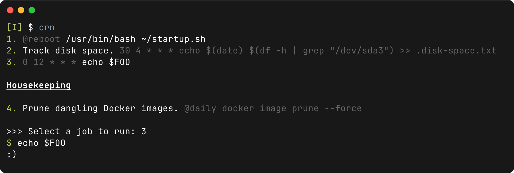

# cronrunner

[](https://www.gnu.org/licenses/gpl-3.0)

[](https://crates.io/crates/cronrunner)
[](https://github.com/qrichert/cronrunner/actions)

_Run cron jobs manually._[^1]

<p align="center">
  
</p>

```crontab
# m h  dom mon dow   command

@reboot /usr/bin/bash ~/startup.sh

## Track disk space.
30 4 * * * echo $(date) $(df -h | grep "/dev/sda3") >> .disk-space.txt

FOO=:)
0 12 * * * echo $FOO

### Housekeeping

## Prune dangling Docker images.
@daily docker image prune --force
```

## Installation

### Directly

```console
$ wget https://github.com/qrichert/cronrunner/releases/download/X.X.X/cronrunner-X.X.X-xxx
$ sudo install ./cronrunner-* /usr/local/bin/cronrunner
$ sudo ln -s /usr/local/bin/cronrunner /usr/local/bin/cr
```

### Manual Build

#### System-wide

```console
$ git clone https://github.com/qrichert/cronrunner.git
$ cd cronrunner
$ make build
$ sudo make install
```

#### Through Cargo

```shell
cargo install cronrunner
cargo install --git https://github.com/qrichert/cronrunner.git
```

[^1]:
    cronrunner used to be a Python project, see
    [1.1.4](https://github.com/qrichert/cronrunner/tree/1.1.4).
